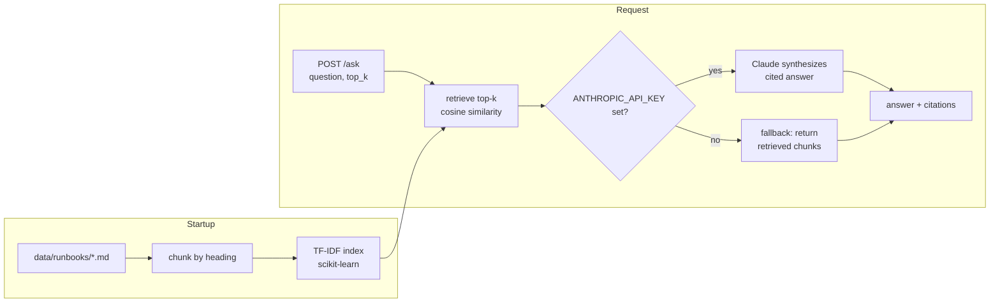

# rag-runbook-assistant

A Retrieval-Augmented Generation (RAG) API that answers operations/on-call questions from a corpus of runbook markdown files, using TF-IDF retrieval and the Anthropic Claude API to synthesize cited answers.


## Overview

On-call engineers waste time grepping through runbooks mid-incident. This project is a small, self-contained demo of a RAG pattern applied to that problem: point it at a folder of runbook markdown files, ask a plain-English question, and get back an answer grounded in — and citing — the relevant runbook sections.

It is intentionally dependency-light. Retrieval is done in-process with **TF-IDF + cosine similarity** (scikit-learn), so the service runs with **zero external services** — no vector database, no embedding API. Answer synthesis uses the official `anthropic` SDK. If `ANTHROPIC_API_KEY` is not set, the `/ask` endpoint **degrades gracefully**: it returns the top retrieved chunks instead of a synthesized answer, so the service is useful (and testable) entirely offline.

This is a portfolio / demonstration project — not a production service and not deployed anywhere.

## Architecture



## Features

- **Zero-infrastructure retrieval** — TF-IDF + cosine similarity in memory; no database or embedding service.
- **Retrieval-only `GET /search`** — inspect the ranked chunks (and their scores) the index would ground an answer on, with no LLM call, no API key, and no token cost.
- **Graceful degradation** — works without an API key by returning retrieved chunks.
- **Citations** — every answer reports the runbook sources and similarity scores it drew from.
- **Heading-aware chunking** — markdown is split on headings so citations map to meaningful sections.
- **Typed API** — FastAPI + Pydantic request/response models with automatic OpenAPI docs at `/docs`.
- **Tested and linted** — pytest covers chunking and retrieval (no network); ruff enforces style in CI.

## Tech stack

- **Python 3.11**
- **FastAPI** + **Uvicorn** — web framework and ASGI server
- **scikit-learn** — TF-IDF vectorization and cosine similarity
- **anthropic** — official Claude SDK for answer synthesis (model id `claude-sonnet-5`)
- **pydantic-settings** — environment-based configuration
- **pytest** + **ruff** — testing and linting

## Getting started

### Prerequisites

- Python 3.11+
- (Optional) An Anthropic API key for LLM synthesis. Without it, the API returns retrieved chunks.

### Install

```bash
git clone https://github.com/matthews-wong/rag-runbook-assistant.git
cd rag-runbook-assistant
python -m venv .venv
source .venv/bin/activate      # Windows: .venv\Scripts\activate
pip install -r requirements.txt
```

### Configure (optional)

```bash
cp .env.example .env
# edit .env and set ANTHROPIC_API_KEY to enable LLM synthesis
```

### Run

```bash
uvicorn app.main:app --reload
```

The API is now at `http://localhost:8000` — interactive docs at `http://localhost:8000/docs`.

### Run with Docker

```bash
docker build -t rag-runbook-assistant .
docker run -p 8000:8000 -e ANTHROPIC_API_KEY=$ANTHROPIC_API_KEY rag-runbook-assistant
```

## Usage

Check health:

```bash
curl http://localhost:8000/health
# {"status":"ok","llm_enabled":false,"indexed_chunks":42}
```

Ask a question:

```bash
curl -X POST http://localhost:8000/ask \
  -H "Content-Type: application/json" \
  -d '{"question": "Redis is rejecting writes with OOM errors, what do I check?", "top_k": 3}'
```

Example response (with `ANTHROPIC_API_KEY` unset — fallback mode):

```json
{
  "answer": "LLM synthesis is unavailable (no ANTHROPIC_API_KEY set). Returning the most relevant runbook excerpts:\n\n[1] redis-oom.md — Mitigation\n...",
  "synthesized": false,
  "citations": [
    {"source": "redis-oom.md", "title": "Mitigation", "score": 0.41},
    {"source": "redis-oom.md", "title": "Triage", "score": 0.33}
  ]
}
```

With an API key set, `synthesized` is `true` and `answer` is a concise, Claude-written response with inline `[n]` citations referencing the returned sources.

Inspect retrieval only (no LLM call, no API key required):

```bash
curl "http://localhost:8000/search?q=redis%20out%20of%20memory%20evictions&top_k=3&min_score=0.1"
```

Example response:

```json
{
  "query": "redis out of memory evictions",
  "count": 2,
  "results": [
    {"source": "redis-oom.md", "title": "Mitigation", "score": 0.41, "text": "## Mitigation\n..."},
    {"source": "redis-oom.md", "title": "Triage", "score": 0.33, "text": "## Triage\n..."}
  ]
}
```

`/search` accepts the same `top_k` and `min_score` controls as `/ask` but never contacts Claude — useful for debugging retrieval or building a UI that ranks sources before spending a synthesis call.

## Project structure

```
rag-runbook-assistant/
├── app/
│   ├── __init__.py
│   ├── main.py        # FastAPI app: GET /health, GET /runbooks, GET /search, POST /ask
│   ├── rag.py         # ingest, chunk, TF-IDF index, retrieve
│   ├── synth.py       # Claude synthesis with graceful fallback
│   └── config.py      # env-based settings (pydantic-settings)
├── data/runbooks/     # sample runbook corpus (markdown)
├── tests/
│   └── test_rag.py    # chunking + retrieval tests (no network)
├── .github/workflows/ci.yml
├── Dockerfile
├── requirements.txt
├── pyproject.toml
├── .env.example
└── README.md
```

## Testing

Tests cover chunking and retrieval only and make no network calls (the Claude API is never contacted in tests):

```bash
pytest
```

Lint:

```bash
ruff check .
```

Both run automatically on push / PR via GitHub Actions (`.github/workflows/ci.yml`).

## Roadmap

- Swap TF-IDF for sentence-embedding retrieval (e.g. a local embedding model) and compare recall on the same corpus.
- Add a `/reload` endpoint to re-index the corpus without restarting the process.
- Stream synthesized answers over Server-Sent Events for a nicer CLI/UX.

## License

MIT — see [LICENSE](LICENSE).

---

Part of my cloud & AI portfolio — see github.com/matthews-wong
